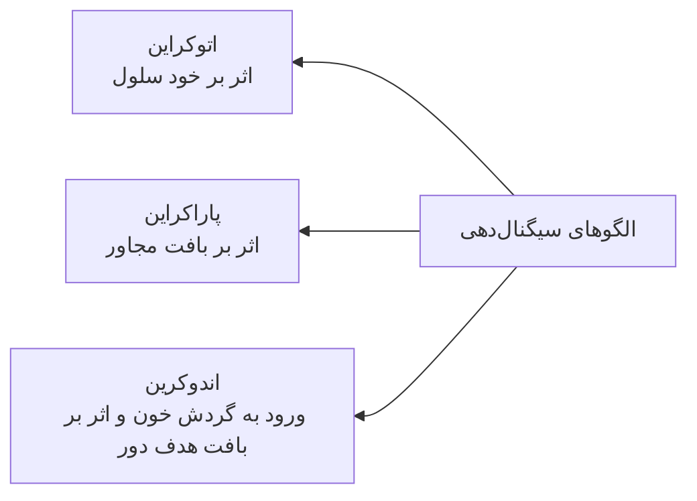
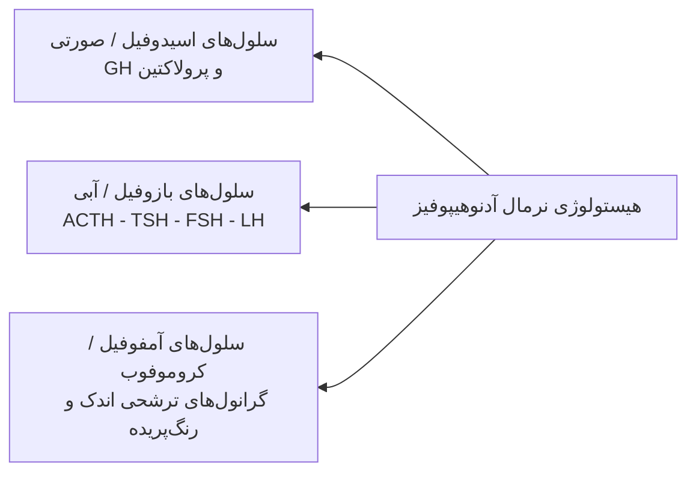
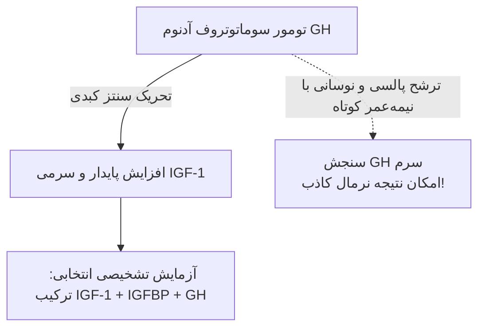
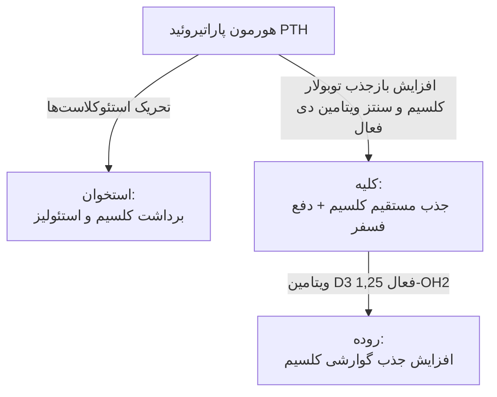
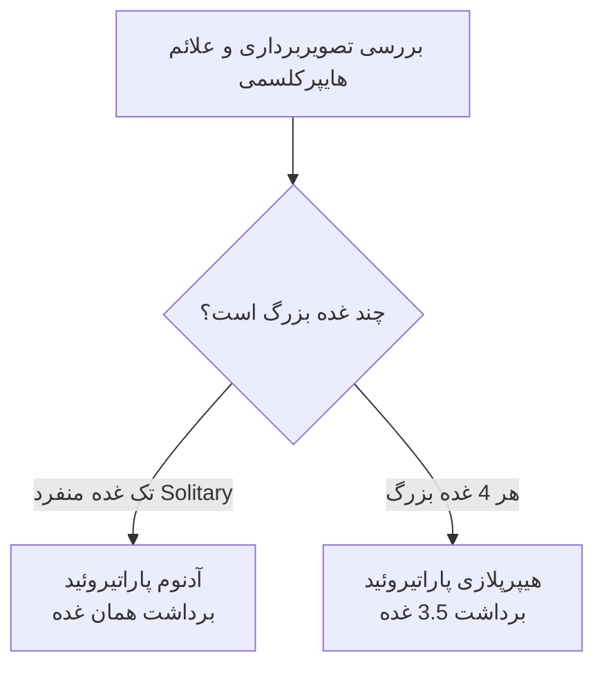
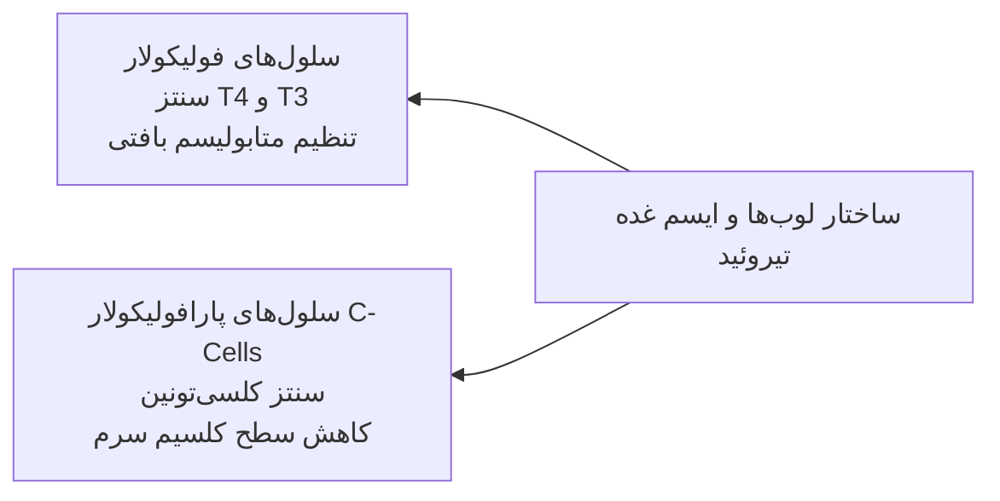
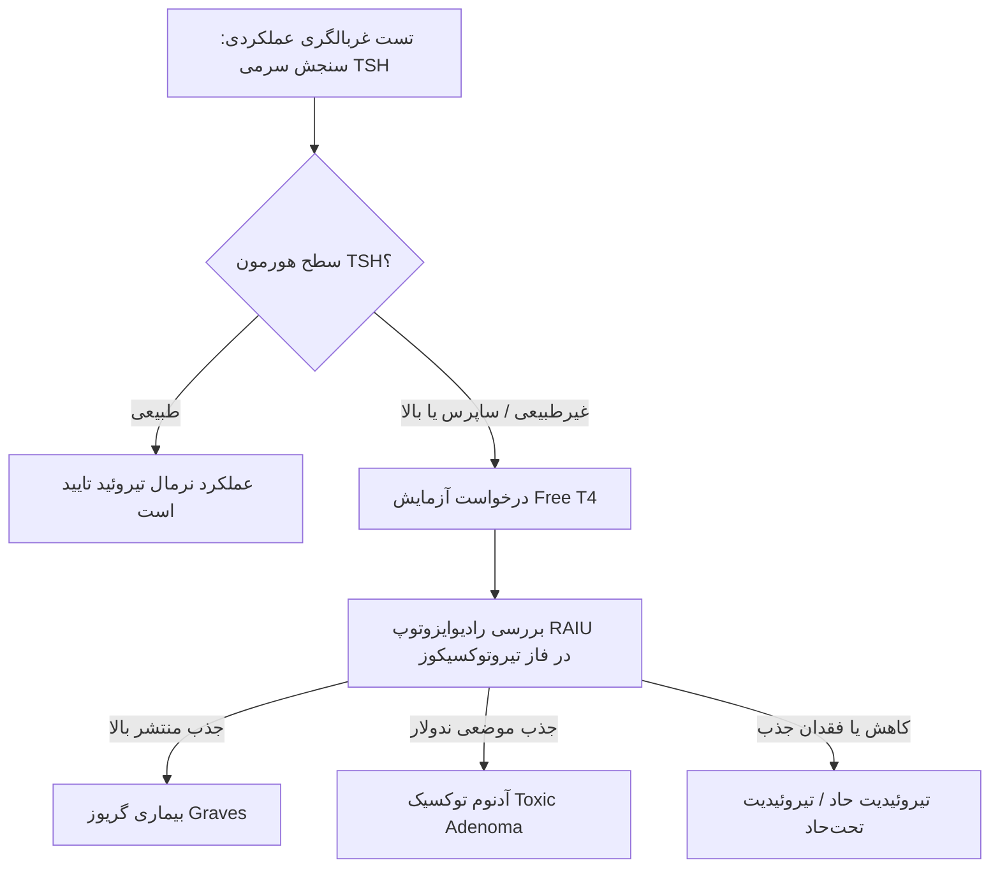

# پاتولوژی سیستم اندوکرین (Endocrine Pathology)

## بخش ۱: مفاهیم پایه، پیام‌رسانی و پاتوفیزیولوژی عمومی اندوکرین

> [!info] تعریف: انواع سیگنالینگ شیمیایی در ترشحات بیولوژیک
> انتقال پیام‌های سلولی بر حسب فاصله سلول مبدأ تا سلول هدف به سه دسته تقسیم می‌گردد:
> 1. **اتوکراین (Autocrine):** ترشح لیگاند و اتصال به گیرنده‌های اختصاصی روی همان *سلول ترشح‌کننده*.
> 2. **پاراکراین (Paracrine):** انتشار لیگاند در ماتریکس بین‌سلولی و اثر بر *سلول‌های مجاور*.
> 3. **اندوکرین (Endocrine):** ورود فرآورده‌های ترشحی (هورمون‌ها) به *جریان خون* و اثر بر ارگان‌های هدف دوردست.

### ۱. ساختار بیوشیمیایی هورمون‌ها و برهم‌کنش گیرنده‌ها
* **هورمون‌های پپتیدی و پروتئینی:** درشت‌مولکول؛ نیازمند اتصال به گیرنده‌های سطح غشای پلاسمایی؛ فاقد توانایی عبور آزاد از غشا. *نمونه‌های بالینی:* **هورمون رشد (GH)** و **انسولین**.
* **مولکول‌های پیام‌رسان کوچک:** عبور سریع یا اثر مستقیم بر گیرنده‌ها. *نمونه بالینی:* **اپینفرین**.
* **هورمون‌های استروئیدی (محلول در چربی / Lipid-soluble):** ساختار لیپوفیل؛ عبور کامل از دولایه لیپیدی غشا؛ استقرار رسپتور در *سیتوپلاسم یا هسته*؛ اثر نهایی مستقیماً در **سطح هسته** با تنظیم رونویسی ژن‌ها. *نمونه‌های بارز:* **استروژن**، **پروژسترون** و **گلوکوکورتیکوئیدها**.

### ۲. الگوهای نارسایی عملکردی و طبقه‌بندی بیماری‌های اندوکرین

> [!abstract] مکانیسم‌های سه‌گانه اختلالات عملکردی در بافت هدف
> 1. **عدم تولید هورمون:** فقدان کامل سنتز به دنبال تخریب بافت پارانشیم یا نقص ژنتیکی.
> 2. **نقص در میان‌کنش هورمون و ارگان هدف:** تولید هورمون نرمال، اما اختلال در سطح رسپتور یا پیام‌رسان‌های درون‌سلولی؛ تظاهر به‌صورت **مقاومت هورمونی** (نظیر مقاومت به *انسولین*).
> 3. **پاسخ ابنرمال بافت هدف:** پاسخ‌دهی غیرفیزیولوژیک بافت به مقادیر نرمال هورمون.

* **طبقه‌بندی آسیب‌شناختی سه‌گانه ضایعات اندوکرین:**
  1. **افزایش کارکرد (Hyperfunction):** بیش‌پروری عملکردی و ترشح بیش از حد فیزیولوژیک هورمون (**Overproduction**).
  2. **کاهش کارکرد (Hypofunction):** کاهش سطح خونی هورمون‌ها به دلایل آتروفی، نکروز، تخریب ایمونولوژیک یا جراحی.
  3. **توده‌ها و نئوپلاسم‌ها (Mass lesions):** اثرات دوگانه بافت تومورال:
     * *تخریب مکانیکی کل بافت غده* ⇦ توقف کامل تولید هورمون و کم‌کاری شدید.
     * *تکثیر تومورال خودمختار (Autonomous)* ⇦ تولید خودمختار هورمون و ایجاد تابلوهای بالینی پرکاری شدید.

---

## بخش ۲: آسیب‌شناسی غده هیپوفیز (Pituitary Gland)

### ۱. آناتومی، ارتباطات جنین‌شناسی و تنظیم هورمونی
* **موقعیت و ابعاد آناتومیک:** قرارگیری در فرورفتگی استخوان اسفنوئید موسوم به **سلا تورسیکا (Sella Turcica)**؛ وزن طبیعی حدود **0.5 گرم**.
* **هیپوفیز قدامی (Adenohypophysis):** بافت غددی ترشحی واقعی مشتق از اکتودرم دهانی؛ تنظیم تحت تأثیر فاکتورهای تحریکی هیپوتالاموس. ترشح‌کننده: **TSH**, **ACTH**, **GH**, **FSH**, **LH**, **Prolactin**.
* **هیپوفیز خلفی (Neurohypophysis):** ساختار نورونی؛ منشأ مستقیم از دیانسفال مغز؛ ترشح‌کننده هورمون‌های سنتزشده در هسته‌های هیپوتالاموس نظیر **ADH** (وازوپرسین) و *اکسی‌توسین*.

> [!important] قاعده فیدبک هیپوتالاموسی هورمون‌های هیپوفیز
> تمام هورمون‌های ترشحی هیپوفیز قدامی تحت کنترل **فیدبک مثبت / تحریکی** واسطه‌های هیپوتالاموسی هستند؛ **تنها استثناء پرولاکتین است** که به‌طور فیزیولوژیک تحت کنترل دائمی **فیدبک منفی / تون مهاری** (توسط *دوپامین*) هیپوتالاموس قرار دارد. تخریب ساقه یا قطع ارتباط هیپوتالاموس-هیپوفیز برعکس سایر هورمون‌ها سبب **افزایش پرولاکتین** می‌گردد.

### ۲. هیستولوژی نرمال هیپوفیز قدامی
* **رنگ‌آمیزی هماتوکسیلین و ائوزین (H&E):** الگوی مختلط با سلول‌های لانه‌لانه‌ای (Nests) محصور در عروق کاپیلری سینوزوئیدی:
  * **سلول‌های ائوزینوفیلیک (Pink cells):** دارای سیتوپلاسم صورتی متراکم (ترشح‌کننده *GH* و *Prolactin*).
  * **سلول‌های بازوفیلیک (Blue cells):** سیتوپلاسم آبی تیره گرانولار (ترشح‌کننده *ACTH*, *TSH*, *FSH*, *LH*).
  * **سلول‌های کروموفوب / آمفوفیل (Pale/Amphophilic cells):** سیتوپلاسم رنگ‌نپریده، با گرانول‌های بسیار اندک یا غیرفعال.

### ۳. پرکاری هیپوفیز (Hyperpituitarism) و آدنوم‌ها
* **اتیولوژی پرکاری:** **آدنوم هیپوفیز** (شایع‌ترین علت با فاصله زیاد)، هیپرپلازی اولیه، کارسینوم، **ترشح اکتوپیک** نئوپلاستیک هورمون‌ها (مانند تومورهای ریه)، ضایعات هیپوتالاموس.
* **ویژگی‌های اپیدمیولوژیک پیتویتاری آدنوم:**
  * دربرگیرنده **10% از کل تومورهای اینتراکرانیال**.
  * اوج سنی تظاهر: دهه‌های **30 تا 50 سالگی**.
  * غالب موارد **ایزوله و منفرد**؛ درصد محدودی در زمینه سندرم‌های ژنتیکی فامیلیال نظیر **MEN-1** (همراهی با آدنوم پاراتیروئید و تومورهای اندوکرین پانکراس).

#### دسته‌بندی اندازه آدنوم‌ها و همبستگی بالینی
* مرز تشخیصی خط‌کش پاتولوژی: **1 سانتی‌متر (10 میلی‌متر)**.
* **میکروآدنوم (< 1 cm):** معمولاً به دلیل فقدان اثر فشاری، تنها در صورت **عملکردی بودن (Functional)** و ایجاد علائم هورمونی کشف می‌شوند.
* **ماکروآدنوم (> 1 cm):** عمدتاً **غیرعملکردی (Non-functional)** بوده؛ دیر مراجعه می‌کنند؛ علت مراجعه تظاهرات **اثر فشاری توده (Mass Effect)** روی **اپتیک کیاسما** و ایجاد **اختلالات میدان بینایی (نظیر همی‌آنوپسی بای‌تمپورال)** قبل از تشخیص اختلال اندوکرین است.

| نوع آدنوم بر اساس هورمون | رتبه شیوع | الگوی تظاهر ماکرو/میکرو | نشانه‌های بالینی کلیدی و تله‌های تشخیصی |
| :--- | :--- | :--- | :--- |
| **پرولاکتینوما (Prolactinoma)** | **رتبه ۱ (شایع‌ترین، 30% تا 50%)** | خانم‌ها: میکروآدنوم آقایان: ماکروآدنوم | در خانم‌ها: *آمنوره*، *گالاکتوره*، ناباروری و کاهش لیبیدو. در آقایان: تظاهر دیرهنگام با افت میل جنسی، اختلالات باروری یا اثر توده‌ای. |
| **آدنوم غیرعملکردی (Non-functional)** | **رتبه ۲** | عمدتاً ماکروآدنوم | فاقد هورمون؛ تظاهر با سردرد، تهاجم موضعی و اختلال دید؛ تخریب بافت مجاور و هیپوپیتویتاریسم. |
| **آدنوم ترشح‌کننده هورمون رشد (GH)** | **رتبه ۳** | متغیر (میکرو و ماکرو) | بسته به صفحات رشد: *ژیگانتیسم* (کودکان) یا *آکرومگالی* (بالغین)؛ اختلالات همراه دیابت و قلبی. |
| **کورتیکوتروف (Cushing Disease)** | شیوع کمتر | غالباً میکروآدنوم | ترشح خودمختار ACTH؛ هیپرکورتیزولیسم، تغییرات فنوتیپی کوشینگ. |
| **گونادوتروف (FSH/LH) و تیروتروف (TSH)** | **بسیار نادر** | عمدتاً ماکروآدنوم | اغلب در مرحله ماکروآدنوم با علائم فشاری کشف شده یا غیرفعال تلقی می‌شوند. |

> [!tip] نکته امتحانی و تله تستی: پاتولوژی بافتی آدنوم در برابر غده نرمال
> در بافت طبیعی هیپوفیز قدامی، *تنوع سلولی (سلول‌های صورتی، آبی و شفاف در کنار هم)* مشهود است. اما نمای کلیدی در پیتویتاری آدنوم، **مونومورفیسم سلولی (Monomorphism)** است؛ تومور منحصراً از تکثیر کلونال یک رده سلولی تشکیل شده (همگی کاملاً آبی، یا همگی صورتی، یا همگی آمفوفیل/روشن) با هسته‌های گرد یونیفرم و دست‌اندازی ساختاری.

> [!danger] تله تشخیصی: خونریزی و نکروز در آدنوم هیپوفیز
> در پاتولوژی تومورهای سایر ارگان‌ها، وجود نکروز و هموراژی مطرح‌کننده درجه بدخیمی و کارسینوم است؛ **اما در آدنوم‌های هیپوفیز، دیدن نکروز و هموراژی دلیلی بر بدخیمی نبوده** و در این نئوپلاسم‌های خوش‌خیم نیز به وفور مشاهده می‌شود.

### ۴. پاتوژنز مولکولی و رفتارهای تهاجمی تومور
* **موتاسیون زیرواحد پروتئین‌های جی (G-Protein Mutations):** اتصال هورمون به رسپتور ⇦ فعال‌سازی زیرواحد **آلفا** ⇦ تحریک آدنیلات سیکلاز ⇦ افزایش سطح **cAMP** ⇦ القای تکثیر سلولی و ترشح هورمون. در حالت عادی، زیرواحد **بتا** روی زیرواحد آلفا اثر مهاری دائمی دارد. جهش در این ژن‌ها مهار فیزیولوژیک زیرواحد بتا را برداشته و سبب **تکثیر اتونوم و ترشح هورمونی مهارنشدنی** می‌گردد.
* **سندرم‌های فامیلیال و مولکول‌های درگیر:** ناهنجاری در **MEN1**, ژن کینازهای وابسته به سایکلین (**CDKI**), ژن **PRKAR1A** و ژن **AIP**.
* **آدنوم‌های تهاجمی (Aggressive Adenomas):** ضایعات فاقد کپسول واقعی، دارای نفوذ و چسبندگی وسیع به ساختارهای سخت‌آمه و بافت اطراف سلا، جراحی بسیار دشوار؛ مرتبط با جهش‌های ژنی در **Cyclin D1**, **RB** و اختلال **p53**.
* **کارسینوم هیپوفیز (Pituitary Carcinoma):** ضایعه‌ای به غایت نادر؛ نیازمند اثبات متاستاز دوردست یا تهاجم قطعی بافت؛ مرتبط با جهش در ژن **HRAS**.

### ۵. پرولاکتینوما؛ جزئیات تشخیصی و شرایط بالینی
* **علل هیپرپرولاکتینمی غیرتومورال:** حاملگی، تحریک فیزیکی نوک پستان (Nipple stimulation)، مصرف داروها (بلوک‌کننده‌های دوپامین)، قطع ساقه هیپوتالاموس و استرس روانی یا فیزیکی.
* **پروتکل استاندارد آماده‌سازی آزمایشگاهی:** پرولاکتین یک هورمون شدیداً حساس به استرس است. شرایط اجباری خون‌گیری:
  1. گذشت حداقل **2 ساعت از بیدار شدن کامل بیمار**.
  2. وضعیت **ناشتایی کامل**.
  3. برخورداری از خواب آرام و کافی در شب پیشین.
  4. استراحت و **آرام‌بخشی به مدت چند دقیقه در محیط آزمایشگاه** پیش از رگ‌گیری.

### ۶. آدنوم ترشح‌کننده GH و پروتکل‌های پاراکلینیک
* **تظاهرات بالینی آکرومگالی:** بزرگی فک پایین (Prognathism)، افزایش فاصله بین دندان‌ها (Diastema)، درشت شدن دست‌ها و پاها. عوارض سیستمیک: **دیابت ملیتوس**، ضعف عضلانی شدید (Muscle weakness)، **هایپرتنشن**، آرتروپاتی و آرتریت، استئوپروزیس و **نارسایی احتقانی قلب (CHF)**.

> [!important] تله تست آزمایشگاهی: چرایی ارزیابی نشدن مستقیم GH
> ترشح فیزیولوژیک GH به صورت **پالسی (Pulsatile)** با نیمه‌عمر بسیار کوتاه در پلاسما است؛ در نتیجه، حتی در حضور تومور ترشح‌کننده ممکن است سطح لحظه‌ای GH نرمال یا پایین باشد. مارکر آزمایشگاهی پایدار برای غربالگری و پیگیری: سنجش **IGF-1** (سنتزشده در کبد با تحریک هورمون رشد) و **پروتئین‌های متصل‌شونده به آن (IGFBP-1, 2, 3)** است.

### ۷. نارسایی هیپوفیز قدامی (Hypopituitarism)
* **قانون آستانه آسیب پاتولوژیک:** بروز علائم کم‌کاری مستلزم **تخریب حداقل 75% از پارانشیم غده** است.
* **اتیولوژی‌های تخریب:**
  1. *آدنوم‌های غیرعملکردی* با ایجاد فشار موضعی آتروفیک.
  2. **پیتویتاری آپوپلکسی (Pituitary Apoplexy):** خونریزی و نکروز ناگهانی و تروماتیک درون تومور موجود در هیپوفیز.
  3. **سندرم شیهان (Sheehan Syndrome):** نکروز ایسکمیک هیپوفیز پس از زایمان به علت خونریزی وسیع، شوک هیپوولمیک و DIC (هیپوفیز در بارداری هیپرتروفی یافته و به افت خونرسانی بسیار حساس است).
  4. اعمال جراحی و رادیوتراپی یا بیماری‌های التهابی.
* **نمای هیستوپاتولوژی ایسکمی:** ائوزینوفیلی شدید و یکپارچه بافت (Coagulative-type necrosis) موسوم به *Ghost cells*.
* **نشانه‌های بالینی تفکیکی:**
  * در کودکان: نقص رشد و کوتولگی (Dwarfism).
  * کمبود گونادوتروفین‌ها: آمنوره و ناباروری در خانم‌ها؛ آتروفی بیضه، افت لیبیدو و از دست رفتن موهای وابسته به آندروژن در آقایان.
  * کمبود TSH و ACTH: علائم هایپوتیروئیدی و هایپوآدرنالیسم شدید بدون هیپرپیگمانتاسیون.
  * **رنگ‌پریدگی پوستی اختصاصی:** ناشی از کاهش همراه **MSH** به دنبال افت پیش‌ساز POMC/ACTH.

> [!important] سرنخ موضع‌یابی ضایعه در درگیری همزمان دو لوب
> اگر در بیماری نارسایی عملکردی هر دو لوب قدامی و خلفی هیپوفیز به طور همزمان ثبت گردد، **منشأ ضایعه اختلال در هیپوتالاموس است** (برداشته شدن همزمان مهارها و فاکتورهای ترشحی).

### ۸. اختلالات هیپوفیز خلفی
* بیماری اصلی: **نقص در ترشح ADH** منجر به **دیابت بی‌مزه سنترال (Central Diabetes Insipidus)** با تظاهر پلی‌اوری شدید و هایپرناترمی.
* تفاوت با دیابت بی‌مزه نفروژنیک: منشأ نفروژنیک اختلال در سطح رسپتورهای لوله‌های جمع‌کننده کلیه است نه بافت اندوکرین مغز.

---

## بخش ۳: آسیب‌شناسی غدد پاراتیروئید (Parathyroid Glands)

### ۱. آناتومی، هیستولوژی و فیزیولوژی عملکردی
* **تعداد و وزن:** معمولاً **4 عدد** غده کوچک زردرنگ در مجاورت کپسول خلفی لوب‌های تیروئید؛ وزن هر غده طبیعی حدود **30 تا 40 میلی‌گرم**. (امکان تنوع از 2 الی 3 غده تا غدد نابجا / اکتوپیک در مدیاستن).
* **سلول‌شناسی نرمال:**
  * **سلول‌های اصلی (Chief cells):** سلول‌های غالب، ریز با سیتوپلاسم آمفوفیل تا شفاف؛ مسئول **سنتز و ترشح PTH**.
  * **سلول‌های اکسی‌فیل (Oxyphil cells):** با افزایش سن پدیدار می‌شوند؛ سلول‌هایی درشت‌تر با سیتوپلاسم به‌شدت اسیدوفیلیک و ائوزینوفیلیک مملو از میتوکندری.
  * **سلول‌های کلیر (Water-clear cells):** سلول‌هایی با سیتوپلاسم کاملاً حباب‌دار و واکوئوله که در هیپرپلازی‌ها نمایان می‌شوند.
* **مکانیسم ترشح هورمون:** ترشح PTH برخلاف هیپوفیز و تیروئید، تحت هیچ هورمون مرکزی نیست و منحصراً توسط **سطح کلسیم یونیزه سرم** کنترل می‌شود (کاهش کلسیم سرم ⇦ محرک مستقیم ترشح PTH).

### ۲. هیپرپاراتیروئیدیسم اولیه (Primary Hyperparathyroidism)
* **علل شایع:**
  1. **آدنوم پاراتیروئید (Parathyroid Adenoma):** مسئول **75% تا 80%** موارد؛ عمدتاً منفرد و ایزوله (**Solitary**).
  2. **هیپرپلازی پاراتیروئید (Primary Hyperplasia):** درگیری **هر 4 غده** به طور منتشر؛ مسئول حدود 15% موارد؛ شایع در زمینه‌های ارثی (MEN-1 و MEN-2A).
  3. **کارسینوم پاراتیروئید (Parathyroid Carcinoma):** تومور بدخیم بسیار نادر؛ کمتر از **5%** موارد؛ سایز تومور بزرگ (گاهی تا **10 سانتی‌متر**).

> [!important] پروتکل پاتولوژی بالینی در حین عمل جراحی پاراتیروئید (Intraoperative Protocol)
> به دلیل کوچکی غدد و دشواری جراحی:
> 1. اندازه‌گیری سطح پایه PTH در خون پیش از آغاز انسزیون جراحی.
> 2. ارسال بیوپسی غده مشکوک به آزمایشگاه پاتولوژی برای **فروزن سکشن (Frozen Section)** حین عمل: تایید خاستگاه بافتی پاراتیروئید و رد برداشت تصادفی لنف‌نود یا چربی.
> 3. پیش از بستن زخم بیمار، خونگیری مجدد جهت **ارزیابی افت سریع سطح سرمی PTH**؛ سقوط چشمگیر هورمون تاییدکننده خارج‌سازی کامل توده عملکردی است.

> [!danger] تله تشخیصی: ملاک افتراق کارسینوم پاراتیروئید از آدنوم
> در بررسی میکروسکوپی غدد پاراتیروئید، **وجود پلی‌مورفیسم، شکل غیرطبیعی سلول‌ها، میتوز یا نکروز به تنهایی ملاک قطعی بدخیمی نیست!** تنها معیار استاندارد و طلایی پاتولوژیست برای تشخیص **کارسینوم پاراتیروئید**، اثبات **تهاجم به کپسول (Capsular invasion)** یا **دست‌اندازی عروقی / ارتشاح به بافت‌های مجاور گردن** است.

### ۳. تظاهرات پاتولوژیک بافت‌های هدف در هیپرکلسمی ناشی از PTH
* **سیستم اسکلتی و ضایعات استخوانی:** بازجذب وسیع املاح کلسیم ⇦ ایجاد حفره‌های کیستیک در استخوان، پوکی شدید و تمایل به شکستگی‌های پاتولوژیک (*Osteitis fibrosa cystica*).
* **تومور قهوه‌ای (Brown Tumor):** ضایعه غیرنئوپلاستیک واکنشی استخوان؛ تجمیع **سلول‌های غول‌آسا (Multinucleated Giant cells)** فراوان در زمینه‌ای از خونریزی، بافت همبند فیبروز و رسوب متراکم رنگدانه **هموسیدرین** که نمای ماکروسکوپیک قهوه‌ای تیره ایجاد می‌کند.
* **سیستم ادراری:** کلسینوز توبولی و تشکیل سنگ‌های کلسیمی کلیه (**Nephrolithiasis**).
* **سیستم گوارشی:** شیوع بالای **زخم‌های پپتیک معده و دوازدهه** (ناشی از اثر کلسیم بر تحریک گاسترین) و سنگ‌های کیسه صفرا.

> [!info] تعریف: کلسیفیکاسیون دیستروفیک در برابر متاستاتیک
> * **دیستروفیک (Dystrophic):** رسوب کلسیم روی بافت مرده و از قبل نکروزه، در شرایطی که کلسیم و فسفر سرم نرمال است.
> * **متاستاتیک (Metastatic):** رسوب املاح کلسیم بر روی **بافت‌های کاملاً سالم و زنده** ناشی از بالا بودن سطح سرمی کلسیم و افزایش حاصل‌ضرب کلسیم در فسفات.

### ۴. هیپرپاراتیروئیدیسم ثانویه و ثالثیه
* **هیپرپاراتیروئیدیسم ثانویه (Secondary):** ترشح واکنشی و جبرانی هورمون پاراتیروئید به علت زمینه مزمن هیپوکلسمی.
  * شایع‌ترین علت: **نارسایی مزمن کلیه (Renal Failure)** (افت دفع فسفات و عدم سنتز فرم فعال ویتامین دی).
  * سایر علل: سوءجذب کلسیم در رژیم غذایی، **استئاتوره (Steatorrhea)** ناشی از اختلالات گوارشی و کمبود شدید ویتامین D.
* **هیپرپاراتیروئیدیسم ثالثیه (Tertiary):** خودمختار شدن فعالیت سلول‌های پاراتیروئید متعاقب تحریک طولانی‌مدت در فاز ثانویه که حتی پس از رفع علت اولیه (نظیر پیوند کلیه) ترشح خودمختار و کنترل‌نشده PTH تداوم می‌یابد.

### ۵. هایپوپاراتیروئیدیسم (Hypoparathyroidism)
* **اتیولوژی عمده:** برداشت ناخواسته یا آسیب به خونرسانی غدد پاراتیروئید حین جراحی‌های گسترده تیروئیدکتومی (**شایع‌ترین علت بالینی**).
* **علائم:** تابلوی حاد و بالینی **هیپوکلسمی** شامل گزگز دور دهان، تتانی، لرزش عضلانی، تشنج‌های صرعی و آریتمی‌های قلبی مهلک. افت کلسیم به زیر **8.5 mg/dL** نگران‌کننده و افت به زیر **9 mg/dL** در وضعیت پرخطر ارزیابی می‌شود.

---

## بخش ۴: آسیب‌شناسی غده تیروئید (Thyroid Gland)

### ۱. ساختار سلولی و ترشحی
* **موقعیت و تشریح:** شامل دو لوب طرفی و یک بخش باریک اتصالی میانی تحت عنوان **ایسم (Isthmus)**.
* **سلول‌های فولیکولار (Follicular cells):** سلول‌های کوبوئیدال احاطه‌کننده لومن کلوئیدی حاوی تیروگلوبولین؛ مسئول ترشح **T4 و T3**.
* **سلول‌های پارافولیکولار (C-cells):** مستقر در بافت بینابینی؛ مسئول ترشح هورمون **کلسی‌تونین (Calcitonin)** جهت کاهش سطح کلسیم پلاسما.

### ۲. تیروتوکسیکوز، هایپرتیروئیدی و رویکرد آزمایشگاهی
* **تیروتوکسیکوز (Thyrotoxicosis):** سندرم بیوشیمیایی ناشی از افزایش سطح هورمون‌های تیروئیدی آزاد در گردش خون به هر دلیلی (شامل تخریب فولیکول‌ها یا مصرف اگزوژن هورمون).
* **هایپرتیروئیدی (Hyperthyroidism):** وضعیتی از تیروتوکسیکوز که علت آن ترشح مازاد با **منشأ مستقیم فعالیت خود غده تیروئید** باشد.
* **علائم بالینی:** کاهش وزن شدید علی‌رغم اشتهای حفظ‌شده یا بالا، تعریق مفرط با پوست مرطوب، عدم تحمل گرما، لرزش، بی‌خوابی، تپش قلب شدید، ایجاد تاکی‌کاردی و **فیبریلاسیون دهلیزی (AF)** و **آتروفی عضلانی پیشرونده** (که در مواردی ممکن است به غلط سوءمصرف مواد افیونی پنداشته شود). در معاینه چشم: بیرون‌زدگی چشم‌ها (Exophthalmos) و تأخیر در بسته شدن پلک (**Lid-lag**).

> [!important] الگوریتم آزمایشگاهی بررسی تیروئید
> 1. **سنجش TSH:** تست انتخابی طلایی جهت غربالگری تیروئید (در هایپرتیروئیدی اولیه TSH کاملاً مهار / ساپرس است).
> 2. در صورت ناهنجاری TSH: سنجش **Free T4** ارجحیت قطعی بر Total T4 دارد؛ چرا که تحت تأثیر تغییرات پروتئین‌های ناقل سرم (TBG) قرار نمی‌گیرد و بازتاب‌دهنده هورمون آزاد و فعال فیزیولوژیک است.
> 3. در صورت نیاز: سنجش **Free T3**.

* **تست جذب ید رادیواکتیو (RAIU):**
  * جذب یکپارچه و منتشر بالا در سراسر غده ⇦ **بیماری گریوز (Graves Disease)**.
  * جذب موضعی متمرکز در یک ندول با ساپرس بقیه بافت ⇦ **آدنوم توکسیک (Hot nodule)**.
  * کاهش چشمگیر یا صفر شدن جذب رادیواکتیو ⇦ **تیروئیدیت‌ها** (ریزپاش کلوئید و هورمون‌های از پیش ساخته به داخل خون به دلیل التهاب، مهار TSH و توقف تولید جدید).

---

### ۳. جدول جامع مقایسه بیماری‌های التهابی و خودایمنی تیروئید

| شاخص پاتولوژیک و بالینی | تیروئیدیت هاشیماتو (Hashimoto) | بیماری گریوز (Graves Disease) | تیروئیدیت ساب‌اکوت گرانولوماتوز (De Quervain) |
| :--- | :--- | :--- | :--- |
| **تعریف و ماهیت بیماری** | التهاب مزمن اتوایمیون منتهی به تخریب ساختار تیروئید و کم‌کاری غده. | پرکاری منتشر اتوایمیون تیروئید با ترشح کنترل‌نشده هورمون‌های تیروئیدی. | التهاب حاد/تحت‌حاد واکنشی بافت تیروئید با ماهیت خودمحدودشونده. |
| **اپیدمیولوژی و جنسیت** | شیوع بالا در خانم‌ها، محدوده سنی 45 تا 60 سال (شایع‌ترین علت گواتر در مناطق با ید کافی). | شیوع زنان به مردان بالا، سن تظاهر زودتر: دهه 20 تا 40 سالگی. | متعاقب عفونت‌های ویروسی تنفسی (مانند گلو‌درد دو هفته پیش از تظاهر). |
| **ژنتیک و اتوآنتی‌بادی‌ها** | HLA-DR3, HLA-DR5, CTLA-4 آنتی‌بادی‌های ضد تیروپراکسیداز (**Anti-TPO**) و آنتی‌تیروگلوبولین. | HLA-DR3, CTLA-4, PTPN22 آنتی‌بادی تحریک‌کننده گیرنده TSH بنام **TSI** و همچنین **TGI** و **TBII**. | ارتباط فامیلیال اثبات‌شده قوی ندارد؛ مکانیسم واکنشی به ویروس مطرح است. |
| **نمای بالینی اختصاصی** | علائم کلاسیک هایپوتیروئیدی، گواتر بدون درد، خشکی پوست، افزایش وزن و میگزدم. | **تریاد اختصاصی:** ۱. تیروتوکسیکوز ۲. افتالموپاتی و اگزوفتالمی ناشی از افزایش بافت رترواوربیتال ۳. درماتوپاتی. | درد شدید موضعی ناحیه گردن و تیروئید، فاز گذرای پرکاری و به دنبال آن بازگشت به فاز نرمال. |
| **نمای پاتولوژی ماکروسکوپیک** | غده بزرگ، محکم، زرد-خاکستری، سفت، با ظاهری مشابه غدد لنفاوی گوشتی. | غده به صورت **دیفیوز و متقارن** بزرگ، هایپروکولار، گوشتی شبیه بافت ماهیچه‌ای (**Beefy-red**). | بزرگ‌شدگی سفت و یکپارچه بدون چسبندگی پایدار، کپسول سالم. |
| **نمای پاتولوژی میکروسکوپیک** | ارتشاح وسیع لنفوسیت‌ها و پلاسماسل‌ها با تشکیل **مراکز زایگر (Germinal Centers)** به همراه **سلول‌های هرتل (Hürthle cells)**. | اپیتلیوم فولیکولار استوانه‌ای بلند، تحلیل کلوئید با پدیده **اسکالوپینگ (Scalloping)** و فولدینگ‌های پاپیلاری خوش‌خیم. | ارتشاح هیستیوسیت‌ها، تخریب حاد فولیکول‌ها و تشکیل **سلول‌های ژانت چند‌هسته‌ای (Multinucleated Giant cells)**. |
| **خطرات بدخیمی و پروگنوز** | ریسک بالای ابتلا به **لنفوم سلول B (Non-Hodgkin Lymphoma)** و کارسینوم پاپیلاری تیروئید (**PTC**). | عود بالینی محتمل، ریسک بدخیمی لنفومی ندارد، درمان علامتی و دارویی رادیواکتیو. | خودمحدودشونده (**Self-limited**)، فاقد ریسک بدخیمی بافتی، نیازمند کنترل علامتی درد. |

---

### ۴. نکات تشخیصی تکمیلی در تیروئیدیت هاشیماتو

> [!info] تعریف: سلول‌های هرتل (Hürthle / Askanazy Cells)
> سلول‌های اپیتلیال فولیکولار تیروئید که در اثر استرس‌های مزمن التهابی دچار متاپلازی ائوزینوفیلیک شده‌اند؛ مشخصه آنها **افزایش اندازه سلولی، سیتوپلاسم صورتی دانه‌دار (گرانولار) متراکم ناشی از تجمع میتوکندری‌ها و یک هسته گرد درشت مرکزی** است.

> [!tip] نکته امتحانی و تله تستی: تفسیر نمونه FNA در هاشیماتو
> مشاهده همزمان ترکیبی از **عناصر ژرمینال سنتر (لنفوسیت‌ها و بافت لنفاوی فعال)** به همراه **سلول‌های متاپلاستیک هرتل** در بیوپسی سوزنی ظریف (FNA) یک ندول تیروئیدی، ویژگی تشخیصی قطعی برای **تیروئیدیت اتوایمیون هاشیماتو** است. با این حال، به دلیل خطر همراهی با کارسینوم پاپیلاری و لنفوم B، هر ندول مجزا و مشکوک بالینی باید آسپیراسیون مجزا گردد.

### ۵. نکات تشخیصی تکمیلی در بیماری گریوز
* **افتالموپاتی نفوذی (Infiltrative Ophthalmopathy):** افزایش حجم عضلات خارج چشمی و ارتشاح بافت رتروبولبار ناشی از رسوب گلیکوزآمینوگلیکان‌ها؛ در برخی بیماران تظاهر چشمی اگزوفتالمی **پیش از هرگونه علامت اندوکرین پرکاری تیروئید** آغاز شده و تظاهر اولیه بیمار است.
* **پدیده اسکالوپینگ (Scalloping):** به دلیل ترشح و بازجذب بسیار سریع کلوئید ناشی از تحریک دائم توسط TSI، حاشیه تماس سلول‌های اپیتلیال با کلوئید داخل لومن نمایی مضرس، دندانه‌دندانه، حباب‌دار و فرورفته پیدا می‌کند.

> [!danger] تله تشخیصی میکروسکوپیک: تفکیک فولدینگ گریوز از پاپیلاری کارسینوم تیروئید (PTC)
> به دنبال هیپرپلازی شدید اپیتلیوم در گریوز، پروجکشن‌ها و چین‌خوردگی‌های پاپیلاری به داخل لومن کلوئید پیشروی می‌کنند. جهت اشتباه نگرفتن این ضایعه خوش‌خیم واکنشی با **سرطان پاپیلاری (PTC)**، پاتولوژیست به ویژگی‌های هسته دقت می‌کند: در گریوز **هسته‌ها گرد، فاقد شیار (Groove)، فاقد انکلوزیون و فاقد نمای شفاف چشمان یتیم آنی (Orphan Annie eye nuclei)** بوده و ویژگی‌های سرشتی سلول‌های نرمال حفظ شده است.
