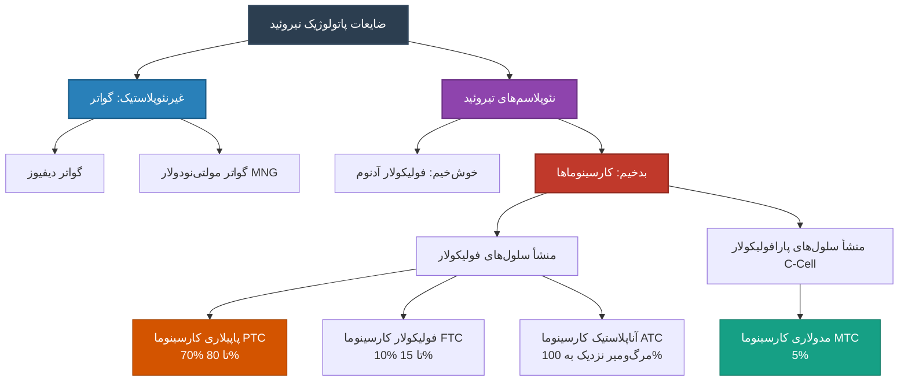
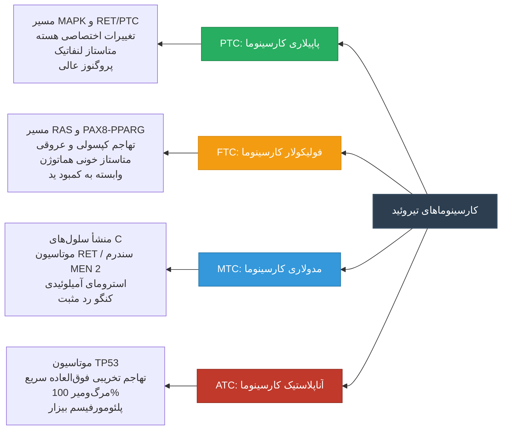
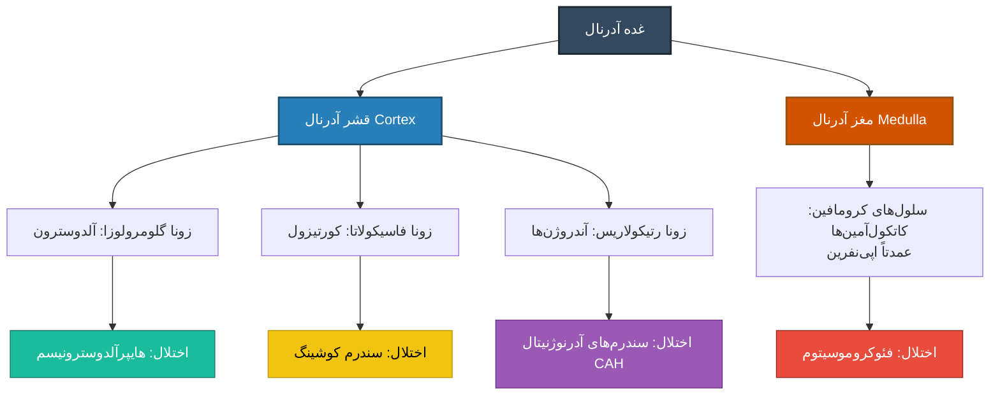
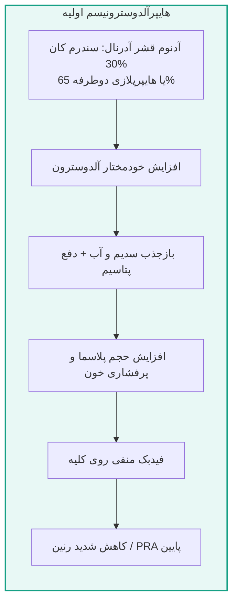
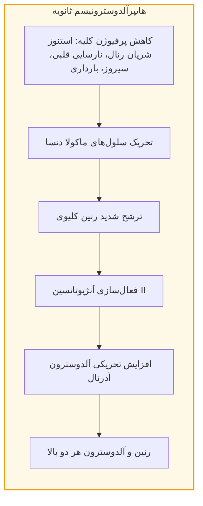
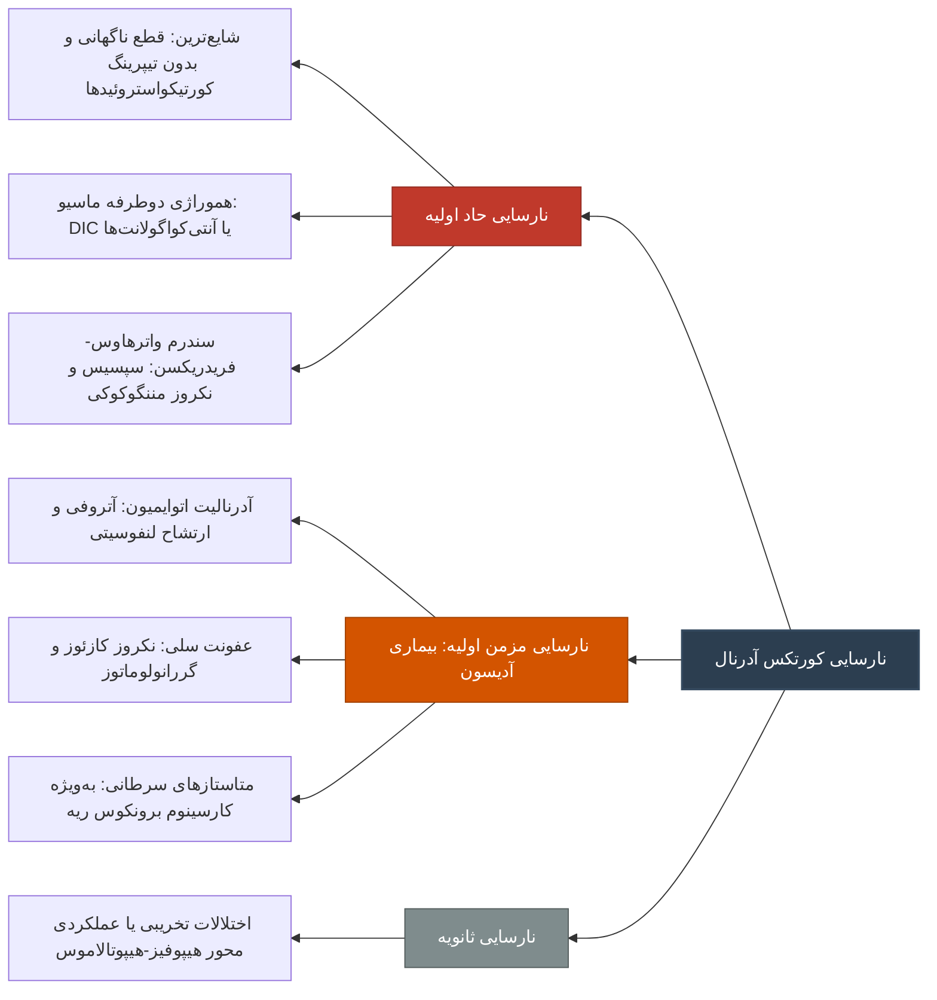
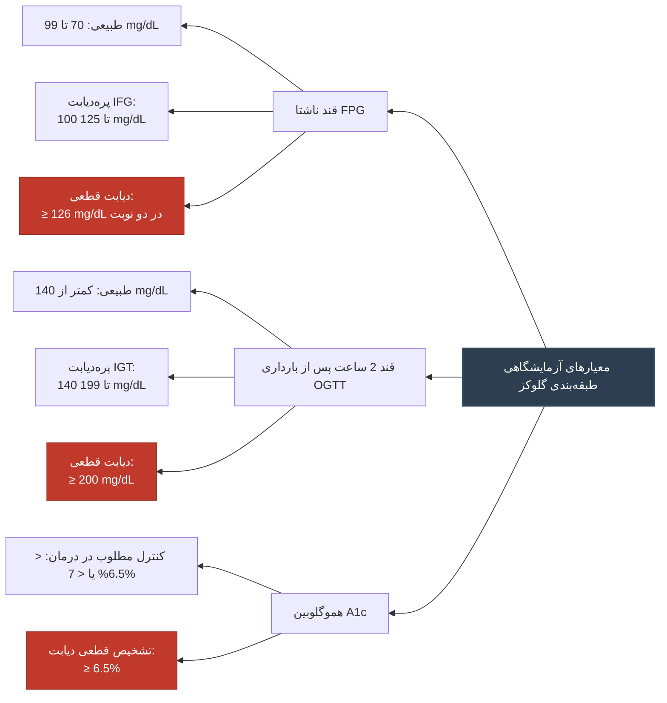

# پاتولوژی بالینی اختلالات تیروئید، آدرنال و متابولیسم گلوکز

## بخش ۱: پاتولوژی غده تیروئید (ضایعات غیرنئوپلاستیک و نئوپلاسم‌ها)

---

### ۱.۱. گواتر (Goiter)

> [!definition] گواتر (Goiter)
> افزایش غیرطبیعی و ژنرالیزه در حجم و ابعاد غده تیروئید به دلایل غیرالتهابی و غیرنئوپلاستیک، با تظاهر بالینی به شکل توده برآمده در قدام گردن همراه با پیامدهای فشاری موضعی.

#### اتیولوژی و پاتوژنز
* **کمبود ید (Iodine Deficiency)**: شایع‌ترین علت غیرخودایمنی (Non-autoimmune) در کشورهای در حال توسعه.
* **مکانیسم مولکولی/سلولی**: فقدان سوبسترای سنتز هورمون (ید) ⇦ افت غلظت خونی هورمون‌های T3 و T4 ⇦ تحریک هیپوفیز قدامی ⇦ افزایش ترشح جبرانی هورمون **TSH** ⇦ اثرگذاری به عنوان فاکتور رشد (Growth Factor) بر گیرنده‌های سلول‌های فولیکولار ⇦ هایپرپلازی سلولی و بزرگ‌شدن ساختاری غده تیروئید.
* **طبقه‌بندی اپیدمیولوژیک**:
  1. **اندمیک (Endemic)**: درگیری بیش از **10%** جمعیت بومی یک منطقه جغرافیایی معین به دلیل فقر خاک و رژیم غذایی از ید.
  2. **اسپورادیک (Sporadic)**: رخداد انفرادی ناشی از نقایص ژنتیکی آنزیم‌های مسیر ساخت هورمون، مصرف ترکیبات گواتروژنیک دارویی نظیر **لیتیوم (Lithium)** یا اختلالات متابولیکی اختصاصی.

#### فازهای پاتولوژیک
* **۱. فاز هایپرپلاستیک (Hyperplastic Phase)**:
  * اثر هورمون TSH بر فولیکول‌ها ⇦ خروج سلول‌ها از آرایش نرمال تک‌لایه‌ای مکعبی (Cuboidal).
  * ایجاد مطبق‌شدگی، هایپرتروفی و هایپرپلازی مشخص در سلول‌های فولیکولار.
  * ماکروسکوپی: بزرگی منتشر و متقارن تیروئید (**Diffuse and Symmetrical Enlargement**).
  * رویکرد بالینی: درمان طبی، ندرتاً نیازمند رزکسیون جراحی.
* **۲. فاز کلوئیدال/تحلیل‌رفتگی (Colloid Phase / Involution)**:
  * پارگی دیواره فولیکول‌های مجاور و اتصال (Fusion) آن‌ها به یکدیگر.
  * تشکیل فولیکول‌های غول‌آسا، بی‌نظم و انباشته از حجم متراکم کلوئید.
  * میکروسکوپی: مسطح‌شدن کامل سلول‌های پوششی اپی‌تلیال فولیکولار (**Flattened Epithelium**) به علت فشار درونی تجمعات کلوئید و توقف فاز هایپرپلازی فعال.

#### مورفولوژی و ویژگی‌های گواتر مولتی‌نودولار (MNG)
* **ماکروسکوپی**: 
  * ابعاد فوق‌العاده متغیر و گاه غول‌آسا (گزارش وزن‌های فراتر از **2000 گرم**؛ ایجاد اثرات فشاری بارز روی نای و مری).
  * سطح مقطع ناهمگن و قهوه‌ای‌رنگ (Brownish cut surface ناشی از ادغام فولیکول‌ها و وفور کلوئید).
  * مشاهده کانون‌های متعدد **خونریزی (Hemorrhage)**، نوارهای **فیبروز (Fibrosis)**، **تغییرات سیستیک (Cystic Changes)** و کلسیفیکاسیون از نوع **دیستروفیک (Dystrophic Calcification)** ثانویه به نکروز بافتی.
* **میکروسکوپی**: فولیکول‌های اتساع‌یافته با پوشش فلت و آتروفیک، فاقد هایپرپلازی سلولی فعال در مراحل پیشرفته، همراه با نواحی گسترده دژنراتیو.

> [!warning] چالش بالینی و تله تشخیصی گواتر مولتی‌نودولار
> لمس نودول‌های متعدد در معاینه گردن به صورت اولیه پزشک را به سوی گواتر مولتی‌نودولار هدایت می‌کند؛ با این وجود، احتمال همزمانی یک **ضایعه نئوپلاستیک بدخیم** در بستر یک گواتر زمینه‌ای وجود دارد. در صورت تمایز ساختاری، سفت‌تر بودن، یا رشد نامتعارف یک نودول نسبت به سایر نودول‌ها، نمونه‌برداری بافتی اختصاصی الزامی است.

---

### ۱.۲. بررسی نودول‌های تیروئید و معیارهای ارزیابی بدخیمی

| پارامتر بالینی/تصویربرداری | الگوی با تمایل بیشتر به بدخیمی | الگوی با تمایل بیشتر به خوش‌خیمی |
| :--- | :--- | :--- |
| **تعداد نودول** | **نودول منفرد (Solitary Nodule)** | نودول‌های متعدد (Multiple Nodules) |
| **سن و جنسیت بیمار** | سنین پایین (جوانان)؛ **جنس مذکر (Men)** | زنان میانسال |
| **سابقه پرتودهی (Radiation)** | سابقه رادیاسیون سروگردن در **دو دهه اول زندگی** | عدم سابقه مواجهه با اشعه |
| **اسکن رادیونوکلئید تیروئید** | **نودول سرد (Cold Nodule)** (فاقد جذب ید) | **نودول گرم (Hot Nodule)** (جذب فعال ید رادیواکتیو) |

> [!important] ارزش تفکیکی معیارهای بالینی نودول‌ها
> معیارهای فوق صرفاً ارزش غربالگری دارند و پیش‌بینی **100% قطعی** ارائه نمی‌دهند؛ بنابراین تصمیم‌گیری نهایی جهت مداخله جراحی بر پایه **سونوگرافی دقیق**، **اسکن تیروئید** و بیوپسی آسپیراسیون با سوزن باریک (**FNA**) استوار است.

---

### ۱.۳. آدنوم فولیکولار تیروئید (Follicular Adenoma)

> [!definition] آدنوم فولیکولار (Follicular Adenoma)
> نئوپلاسم خوش‌خیم و تک‌کانونی برآمده از سلول‌های فولیکولار اپی‌تلیوم تیروئید، محصور در یک کپسول فیبروزه پیوسته و بدون شواهد تهاجم بافتی.

* **ویژگی‌های عملکردی (Functional Status)**:
  * در اکثر موارد غیرعملکردی (**Non-functional**).
  * گاهی نودول فعال و ترشح‌کننده بوده و سبب پرکاری تیروئید می‌گردد (**Toxic Adenoma**).
* **پروفایل ژنتیکی**:
  * در آدنوم‌های سمی/عملکردی: موتاسیون‌های سوماتیک در مسیر **گیرنده TSH (TSH-R)**.
  * در اقلیت موارد غیرعملکردی: بروز جهش‌های ژنی در مسیر **RAS** یا فیوژن‌های ژنی ویژه مانند **PAX8-PPARG** (نشانگر خطر بالاتر انحراف سلولی به سمت بدخیمی).
* **مورفولوژی**:
  * توده سالید، منفرد، کاملاً مدور و متراکم با حدود بسیار مشخص.
  * حضور **کپسول ظریف فیبروزه، یکنواخت و کاملاً دست‌نخورده** که تومور را از پارانشیم نرمال پیرامونی تفکیک می‌کند.
  * سلول‌ها تمایزیافته، یکنواخت و فاقد آتیپی سلولی شاخص؛ چیدمان به شکل فولیکول‌های ریز تا درشت واجد کلوئید و گاه نمای سالید متراکم با کلوئید بسیار اندک.

> [!important] قانون انکولوژی تیروئید در ارتباط با آدنوم فولیکولار
> **آدنوم فولیکولار واقعی هرگز به کارسینوم فولیکولار تبدیل نمی‌شود!** بازگشت یا پیشرفت بیماری پس از جراحی آدنوم، نشانه عدم تمایز اولیه از یک *کارسینوم فولیکولار با تمایز بالا* به دلیل نمونه‌برداری ناکافی و نقص در ثبت پاتولوژی کپسول تومور است.

---

### ۱.۴. کارسینوماهای تیروئید (Malignant Thyroid Neoplasms)

#### پاپیلاری تایروئید کارسینوما (PTC)
* **اپیدمیولوژی**: شایع‌ترین بدخیمی تیروئید (**70% تا 80%** موارد). شایع در بازه سنی **20 تا 40 سال**. شیوع کلی در زنان بیشتر از مردان، ولی در دو دهه اول زندگی و پس از دوران میانسالی نسبت جنسیتی تقریباً برابر است.
* **ریسک‌فاکتورها و پاتوژنز**: پرتوتابی یونیزان محیطی به گردن؛ فعال‌سازی جهش‌های مسیر کینازی شامل **MAPK** و بازآرایی‌های کروموزومی **RET/PTC**.
* **فاکتورهای همراه با پروگنوز بد (Poor Prognosis)**:
  1. سن بروز بالاتر از **40 سال**.
  2. وجود تهاجم بافتی به خارج غده تیروئید (**Extrathyroidal Extension**).
  3. وقوع **متاستاز دوردست (Distant Metastasis)**.
* **مورفولوژی ماکروسکوپی**: نودول با حدود نسبتاً مشخص، پاپیلاری، سالید-سیستیک همراه با خارهای ظریف و نقاط ریز و سخت سفیدرنگ (نواحی کلسیفیکاسیون).
* **معیارهای تعیین‌کننده میکروسکوپی و سیتولوژی**:
  * زواید انگشت‌مانند پاپیلاری واجد یک محور مرکزی بافت همبند-عروقی (**Fibrovascular Core**).
  * *تله هیستولوژی*: نمای پاپیلاری اختصاصی PTC نیست (در گریوز و گواتر نیز به دلیل تکثیر سلولی شدید دیده می‌شود).
  * **معیارهای طلایی هسته‌ای (Pathognomonic Nuclear Features)**:
    1. **هسته‌های روشن و شفاف (Ground-glass / Optically Clear Nuclei)** (اصطلاحاً نمای *Orphan Annie eye*).
    2. انکلوزیون‌های سودوهسته‌ای داخل سیتوپلاسمی (**Intranuclear Pseudo-inclusions**).
    3. شیارهای طولی هسته شبیه دانه قهوه (**Nuclear Grooves**).
  * **ساموما بادی (Psammoma Bodies)**: اجسام کلسیفیه با ساختار دوّار و لایه‌لایه شبیه پیاز (**Onion-like Calcification**). کشف آن در بافت پیرامونی یا غدد لنفاوی گردنی، به نفع متاستاز پاپیلاری کارسینوما است.

#### فولیکولار تایروئید کارسینوما (FTC)
* **اپیدمیولوژی و علل**: رده سنی بالاتر از PTC، شیوع بالاتر در زنان، وابسته به **کمبود طولانی‌مدت ید** و موتاسیون‌های ژن‌های **RAS** و **PIK3CA**.
* **چالش بزرگ سیتولوژی**: تشخیص افتراقی FTC از آدنوم فولیکولار با بیوپسی سوزنی (FNA) یا بررسی ساختار انفرادی سلول‌ها غیرممکن است (هسته‌ها کاملاً تمایزیافته و شبیه بافت نرمال هستند).
* **دو معیار انحصاری هیستوپاتولوژی برای قطعی‌سازی کارسینوم**:
  1. **تهاجم تمام‌ضخامت به کپسول تومور (Capsular Invasion)** و فراتر رفتن از آن.
  2. **تهاجم سلول‌های بدخیم به عروق خونی (Vascular Invasion)** در کپسول یا فراتر از آن.
* *نکته تشخیصی تکنیکال*: برای اثبات تهاجم عروقی یا کپسولی گاهی نیاز به تهیه **70 تا 100 بلوک بافتی پاتولوژی** از نمونه جراحی جهت ممانعت از خطای منفی کاذب است.
* **الگوی متاستاز**: برخلاف PTC که متاستاز لنفاتیک دارد، FTC تهاجم **هماتوژن (Hematogenous)** نشان داده و به ارگان‌های دوردست شامل **استخوان‌ها، ریه و کبد** انتشار می‌یابد.

#### مدولاری تایروئید کارسینوما (MTC)
* **منشأ بافتی**: سلول‌های پارافولیکولار (C-cells) ترشح‌کننده کلسی‌تونین (نه سلول‌های فولیکولار).
* **پروفایل ژنتیکی و توزیع اتیولوژیک**:
  * **70% اسپورادیک (Sporadic)** و تک‌گیر.
  * **30% فامیلیال و ارثی**، همراه با سندرم‌های **MEN 2A** یا **MEN 2B**، با جهش قطعی در انکوژن **RET**.
* **مورفولوژی**: نودول‌های سالید، سلول‌های پولی‌گونال، گرد یا دوکی‌شکل (Spindle-shaped cells).
* **نشانه بیومارکری و بافتی**: رسوب بی‌شکل (Amorphous) مواد کلوئیدمانند صورتی در استروما که ماهیت **آمیلوئید (Amyloid)** ناشی از پلی‌مریزاسیون کلسی‌تونین دارد؛ شناسایی قطعی با رنگ‌آمیزی **کنگو رد (Congo Red)** و متجلی‌شدن خاصیت دوشکستی سبزسیبی (Apple-green Birefringence) زیر نور پلاریزه.

#### آناپلاستیک تایروئید کارسینوما (ATC)
* **رفتار بیولوژیک**: تومور با تمایززدایی کامل، پرخاشگری بیولوژیک مهارنشدنی و **میزان مورتالیتی نزدیک به 100%**. پیشرفت تومور بسیار سریع‌تر از رویکردهای تشخیصی/درمانی است؛ زنده ماندن بیمار تشخیص ATC را به زیر سؤال می‌برد.
* **پاتوژنز**: جهش‌های غیرفعال‌کننده حیاتی در ژن سرکوب‌گر تومور **TP53 (p53)**؛ حدود **25%** بیماران دارای سابقه تومورهای تمایزیافته (مانند PTC یا FTC) بوده و در **25%** موارد همزمانی کانون تمایزیافته با آناپلاستیک در بافت مشاهده می‌گردد.
* **میکروسکوپی**: سلول‌های شدیداً بیزار (Bizarre Giant Cells)، پلئومورفیسم سلولی شدید، نمای شبیه به سارکوم‌های تمایزنیافته، میتوزهای غیرطبیعی متعدد و نواحی وسیع نکروز. اثبات منشأ با ایمونوهیستوشیمی (IHC) صورت می‌گیرد.

---

### جدول مقایسه‌ای: تمایز ۴ بدخیمی اصلی غده تیروئید

| نوع تومور | درصد شیوع | منشأ سلولی | جهش‌های مولکولی تیپیک | مشخصه بافتی/سیتولوژیک کلیدی | مسیر شایع متاستاز |
| :--- | :--- | :--- | :--- | :--- | :--- |
| **پاپیلاری (PTC)** | 70% تا 80% | سلول فولیکولار | مسیر MAPK، موتاسیون RET/PTC | هسته شفاف (Ground-glass)، شیار هسته، ساموما بادی | غدد لنفاوی ناحیه‌ای (لنفاوی) |
| **فولیکولار (FTC)** | 10% تا 15% | سلول فولیکولار | مسیر RAS و PAX8-PPARG | ضرورت تهاجم کپسولی یا عروقی جهت تشخیص | استخوان، ریه، کبد (خونی) |
| **مدولاری (MTC)** | ~5% | سلول پارافولیکولار (C-cell) | جهش انکوژن RET (سندرم MEN 2) | استرومای آمیلوئیدی واجد رنگ‌پذیری با کنگو رد | خون و لنفاتیک موضعی |
| **آناپلاستیک (ATC)** | 1% تا 2% | سلول فولیکولار تمایززدوده | جهش سرکوب‌گر TP53 (p53) | پلئومورفیسم ژانت‌سل بیزار، میتوز آتیپیک، نکروز وسیع | تهاجم تخریبی موضعی سریع و عروقی |

---

## بخش ۲: پاتولوژی و اختلالات هورمونی غده آدرنال (فوق‌کلیه)

### ۲.۱. آناتومی و بافت‌شناسی عملکردی آدرنال
* **کورتکس (قشر آدرنال - منشأ مزودرم)**:
  1. **زونا گلومرولوزا (Zona Glomerulosa)**: لایه سطحی زیر کپسول؛ ترشح مینرالوکورتیکوئیدها شامل **آلدوسترون (Aldosterone)**. تنظیم با محور رنین-آنژیوتانسین (RAAS).
  2. **زونا فاسیکولاتا (Zona Fasciculata)**: لایه میانی، بیشترین حجم و وزن کورتکس؛ ترشح گلوکوکورتیکوئیدها شامل **کورتیزول (Cortisol)**. سلول‌ها حاوی قطرات متعدد چربی داخل‌سیتوپلاسمی (سلول‌های کف‌آلود یا *Foamy cells*؛ زرد در ماکروسکوپی). تنظیم توسط ACTH.
  3. **زونا رتیکولاریس (Zona Reticularis)**: لایه مجاور مغز آدرنال؛ ترشح هورمون‌های جنسی پیش‌ساز (آندروژن‌ها). تنظیم توسط ACTH.
* **مدولا (مغز آدرنال - منشأ اکتودرم لوله عصبی)**:
  * سلول‌های نورواندوکرین کرومافین؛ ترشح کاتکول‌آمین‌ها (به‌ویژه **اپی‌نفرین** و به میزان کمتر نوراپینفرین).

---

### ۲.۲. هایپرکورتیزولیسم و سندرم کوشینگ (Cushing Syndrome)

> [!definition] سندرم کوشینگ (Cushing Syndrome)
> مجموعه‌ای از تظاهرات بالینی، بیوشیمیایی و بافتی ناشی از قرارگیری مزمن بافت‌های بدن در معرض غلظت‌های نامتعارف و افزایش‌یافته گلوکوکورتیکوئیدها (کورتیزول).

#### اتیولوژی و دسته‌بندی پاتولوژیک
1. **فرم اگزوژن (Exogenous/Iatrogenic)**: **شایع‌ترین علت کلی سندرم کوشینگ**؛ ثانویه به تجویز دارویی استروئیدها (مانند پردنیزولون). فیدبک منفی شدید بر محور هیپوفیز ⇦ افت هورمون ACTH ⇦ **آتروفی دوطرفه قشر آدرنال (Bilateral Cortical Atrophy)**.
2. **فرم اندوژن وابسته به ACTH (ACTH-Dependent)**:
   * **بیماری کوشینگ (Cushing Disease)**: آدنوم کورتیکوتروف هیپوفیز (معمولاً میکروآدنوم‌های مترشحه ACTH) ⇦ هایپرپلازی قشر هر دو آدرنال.
   * *تغییر هیالینی کروک (Crooke Hyaline Change)*: تجمع فیلامنت‌های بینابینی کراتین هموژن ائوزینوفیل در سیتوپلاسم سلول‌های کورتیکوتروف غیرتومورال هیپوفیز در اثر سرکوب طولانی‌مدت توسط کورتیزول بالا.
   * **ترشح اکتوپیک ACTH (Ectopic ACTH)**: ناشی از تومورهای غیرهیپوفیزی (به‌ویژه *Small Cell Lung Carcinoma*).
3. **فرم اندوژن غیروابسته به ACTH (ACTH-Independent)**:
   * آدنوم کورتکس آدرنال (**Adrenocortical Adenoma**)، کارسینوم آدرنال، یا هایپرپلازی نودولار اولیه؛ ترشح مستقل کورتیزول ⇦ سرکوب ACTH ⇦ **آتروفی پارانشیم نرمال باقی‌مانده و آتروفی کامل آدرنال طرف مقابل**.

#### تظاهرات بالینی شاخص
* چهره گرد پُرخون و ماه‌مانند (**Moon Face**)، تجمع چربی دورسال در بین دوشاخه‌ها (**Buffalo Hump**)، چاقی مرکزی/شکمی (Truncal Obesity).
* پوست نازک و مستعد اکیموز، **استریاهای بنفش عریض (Purple Striae)** بر روی شکم، ضعف عضلات پروگزیمال ناشی از تخریب کاتابولیک پروتئین‌ها، پوکی استخوان (Osteoporosis)، عدم تحمل گلوکز و مستعدشدن به دیابت ملیتوس، افسردگی و اختلالات روان‌پزشکی.

---

### ۲.۳. هایپرآلدوسترونیسم (Hyperaldosteronism)

> [!important] قاعده سرانگشتی امتحانی برای کشف هایپرآلدوسترونیسم
> هرگاه بیماری با تابلوی **فشار خون بالا (Hypertension)** همزمان با **افت پتاسیم سرم (Hypokalemia)** مراجعه نماید، اولین و قطعی‌ترین تشخیص بالینی، **هایپرآلدوسترونیسم** است تا زمانی که خلاف آن با آزمایش‌ها به اثبات برسد!

#### علل، تمایز بیوشیمیایی و تست‌های پاراکلینیک
* **تست تشخیصی افتراقی**: سنجش نسبت غلظت آلدوسترون پلاسما به فعالیت رنین پلاسما (**Plasma Renin Activity - PRA**). فعالیت رنین با ارزیابی سنتز آنزیمی آنژیوتانسین I بررسی می‌شود؛ این تست‌ها در دو وضعیت **خوابیده (Supine)** و **نشسته (Upright)** جهت ارزیابی تمایزی انجام می‌گیرند.

| ویژگی بیوشیمیایی/پاتولوژیک | هایپرآلدوسترونیسم اولیه (Primary) | هایپرآلدوسترونیسم ثانویه (Secondary) |
| :--- | :--- | :--- |
| **سطح آلدوسترون سرم** | افزایش‌یافته ($\uparrow$) | افزایش‌یافته ($\uparrow$) |
| **فعالیت رنین پلاسما (PRA)** | **شدیداً سرکوب‌شده و پایین** ($\downarrow$) | **افزایش‌یافته و بالا** ($\uparrow$) |
| **شایع‌ترین علل بافتی/بالینی** | هایپرپلازی دوطرفه آدرنال (65%)؛ آدنوم آدرنال (سندرم کان) (30%)؛ کارسینوما (<1%) | استنوز شریان کلیه، هیپووولمی/خونریزی، سیروز، سندرم نفروتیک، بارداری (تحریک رنین توسط استروژن) |
| **وضعیت غده سمت مقابل در آدنوم** | **غیرآتروفیک** (زیرا فاقد وابستگی به ACTH است) | پارانشیم نرمال یا هایپرپلاستیک بر اساس علت زمینه‌ای |

> [!warning] تمایز آتروفی آدرنال در آدنوم‌های کورتیزول در برابر آدنوم‌های آلدوسترون
> در آدنوم ترشح‌کننده **کورتیزول**، سرکوب هورمون ACTH موجب **آتروفی آدرنال مقابل** می‌گردد. در آدنوم ترشح‌کننده **آلدوسترون**، به دلیل کنترل غده توسط مدار رنین-آنژیوتانسین و عدم مداخله ACTH، غده طرف مقابل دچار آتروفی ساختاری **نمی‌شود**.

---

### ۲.۴. کارسینوم قشر آدرنال (Adrenocortical Carcinoma - ACC)
* تومورهای **فوق‌العاده نادر** با ابعاد بسیار بزرگ، رفتار تهاجمی بالا و مرزهای نامشخص.
* در مقایسه با آدنوم‌ها که محدود و زردرنگ هستند، کارسینوم‌ها توده‌های حجیم و هتروژن همراه با کانون‌های وسیع نکروز، هموراژی و تغییرات سیستیک می‌باشند.
* **تهاجم به بافت مجاور**: اغلب کپسول را درنوردیده و به **پارانشیم کلیه زیرین** نفوذ می‌کنند؛ به گونه‌ای که در زمان رزکسیون جراحی، حفظ کلیه غیرممکن بوده و نیاز به برداشت توأم کلیه (نفروکتومی) پدید می‌آید.
* *معیار بدخیمی*: پلئومورفیسم سلولی، هسته‌های بیزار و ژانت‌سل‌ها در آدنوم خوش‌خیم نیز دیده می‌شوند؛ **معیار قطعی کارسینوم، تهاجم کپسولی، نفوذ عروقی و اثبات بالینی یا رادیولوژیک متاستاز است**.

---

### ۲.۵. سندرم‌های آدرنوژنیتال و هایپرپلازی مادرزادی آدرنال (CAH)

> [!definition] هایپرپلازی مادرزادی آدرنال (Congenital Adrenal Hyperplasia - CAH)
> گروهی از بیماری‌های متابولیک با وراثت اتوزومال مغلوب (Autosomal Recessive) ناشی از نقص آنزیمی در مسیر بیوسنتز استروئیدهای کورتکس آدرنال، منجر به کاهش کورتیزول، ترشح افسارگسیخته ACTH و هایپرپلازی دوطرفه آدرنال همراه با انحراف سوبستراها به سمت تولید مازاد آندروژن‌ها.

#### افتراق آزمایشگاهی منشأ ترشح آندروژن‌ها
* آندروستندیون (**Androstenedione**) و **DHEA** ممکن است از گنادها (تخمدان/بیضه) یا آدرنال ترشح شوند و هم‌پوشانی دارند.
* **دهیدروآپی‌آندروسترون سولفات (DHEA-S)** و **آندروستندیول (Androstenediol)** متابولیت‌های **کاملاً اختصاصی قشر غده آدرنال** هستند و ترشح گنادی ندارند؛ اندازه‌گیری آن‌ها در کنار تستوسترون و **17-هیدروکسی پروژسترون (17-OHP)** جهت تفکیک منبع افزایش آندروژن ضروری است.

#### تظاهرات پاتوفیزیولوژیک CAH
* **آنزیم‌های درگیر**: شایع‌ترین حالت، کمبود آنزیم **21-هیدروکسیلاز (21-Hydroxylase)**؛ در رده‌های بعدی کمبود 11-بتا هیدروکسیلاز.
* **اشکال بالینی بیماری**:
  1. **اشکال نوزادی شدید (نقص کلاسیک کامل)**:
     * بروز در بدو تولد با **ابهام جنسی (Ambiguous Genitalia)** در نوزادان دختر (XX, 46)؛ به علت اثر ماسکولینیزاسیون آندروژن‌ها بر دستگاه تناسلی خارجی، نوزاد علی‌رغم داشتن رحم و تخمدان نرمال در سونوگرافی، دستگاه تناسلی مبهم یا مشابه مذکر نشان می‌دهد.
     * **کریز حاد آدرنال (Adrenal Crisis / Salt-wasting crisis)**: نقص همزمان آلدوسترون و کورتیزول ⇦ افت شدید سدیم ($Na^+\downarrow$)، افزایش خطرناک پتاسیم ($K^+\uparrow$)، دهیدراتاسیون شدید، اسهال و استفراغ؛ در صورت عدم مداخله اورژانسی سریع در روزهای اول پس از تولد منجر به فوت می‌شود.
  2. **اشکال با شدت متوسط**: تظاهر در سنین کودکی با **بلوغ زودرس (Precocious Puberty)** در پسربچه‌ها.
  3. **اشکال خفیف (Late-onset)**: تظاهر در حوالی بلوغ و بزرگسالی در دختران به شکل هیرسوتیسم (موهای زاید)، آکنه شدید و اولیگومنوره.

> [!important] اصل معاینه بالینی نوزادان
> مشاهده هرگونه **ابهام تناسلی (Ambiguous Genitalia)** در بدو تولد، تا زمان رد قطعی توسط آزمایش‌های هورمونی، باید یک مورد **هایپرپلازی مادرزادی آدرنال (CAH)** در معرض خطر مرگ ناشی از کریز نارسایی آدرنال تلقی گردد.

---

### ۲.۶. نارسایی قشر آدرنال (Adrenal Insufficiency)

#### نارسایی حاد کورتکس آدرنال (Acute Adrenocortical Insufficiency)
* **شایع‌ترین علت بالینی**: **قطع ناگهانی درمان با کورتون اگزوژن** بدون کاستن تدریجی دوز (Tapering). به دلیل آتروفی طولانی‌مدت غده ناشی از سرکوب ACTH، غده قادر به پاسخ به نیاز پایه‌ای و استرس نیست.
* **سندرم واترهاوس-فریدریکسن (Waterhouse-Friderichsen Syndrome)**: سپسیس برق‌آسا و سپتی‌سمی، کلاپس قلبی-عروقی، ترومبوزهای وسیع عروقی همراه با **خونریزی دوطرفه شدید و نکروز کامل بافت آدرنال**.
  * میکروارگانیسم کلاسیک: **نیسریا مننژیتیدیس (Meningococcus)**.
  * سایر پاتوژن‌ها: سودوموناس (*Pseudomonas*)، هموفیلوس آنفلوانزا (*H. influenzae*) و استافیلوکوکوس اورئوس.

#### نارسایی مزمن کورتکس آدرنال (بیماری آدیسون - Addison Disease)
* بروز علائم بالینی مشروط به **تخریب بیش از 90% بافت پارانشیمال کورتکس آدرنال** است.
* **اتیولوژی**:
  1. **آدرنالیت اتوایمیون (Autoimmune Adrenalitis)**: شایع‌ترین عامل در کشورهای توسعه‌یافته؛ ماکروسکوپی: تحلیل شدید و کوچک‌شدن ابعاد و وزن غده؛ میکروسکوپی: ارتشاح لنفوسیتی در میان سلول‌های باقی‌مانده.
  2. **سل (Tuberculosis)**: واکنش نکروزان گرانولوماتوز همراه با نکروز کازئوز و کلسیفیکاسیون غده.
  3. **عفونت با ویروس نقص ایمنی اکتسابی (HIV/AIDS)**.
  4. **متاستاز نئوپلاسم‌ها**: به دلیل عروق غنی آدرنال، از شایع‌ترین اهداف متاستازهای سرطانی به ویژه **کارسینوم اولیه ریه (Lung Cancer)** و سرطان برست است.
* **تظاهرات بالینی و بیوشیمیایی**: ضعف پیشرونده و بی‌حالی، کاهش وزن شدید، علائم بارز گوارشی (تهوع، استفراغ مداوم، دردهای شکمی، اسهال).
* **پیگمانتاسیون پوست (Hyperpigmentation)**: تیرگی برنزی پوست و مخاط دهان به دلیل افزایش سنتز پیش‌ساز پرو-اوپیوملانوکورتین (POMC) و ترشح جبرانی بسیار بالای **ACTH** (حاوی اثر ملانوسیتیک مشابه هورمون MSH) در غیاب فیدبک منفی.
* *نقص الکترولیتی و متابولیک*: **هیپوناترمی ($Na^+\downarrow$)** و **هایپرکالمی ($K^+\uparrow$)** ناشی از فقدان آلدوسترون، به همراه **هیپوگلایسمی** ناشی از کمبود گلوکوکورتیکوئید.

---

### جدول مقایسه‌ای: نارسایی آدرنال اولیه در برابر ثانویه

| مؤلفه ارزیابی                     | نارسایی اولیه (بیماری آدیسون)                           | نارسایی ثانویه                                        |
| :-------------------------------- | :------------------------------------------------------ | :---------------------------------------------------- |
| **محل آناتومیک ضایعه**            | خود قشر غده آدرنال                                      | هیپوفیز قدامی یا هیپوتالاموس                          |
| **سطح ACTH سرم**                  | **افزایش‌یافته و بسیار بالا** ($\uparrow$)              | **کاهش‌یافته یا نامتناسباً نرمال** ($\downarrow$)     |
| **تغییرات رنگدانه‌ای پوست**       | **هایپرپیگمانتاسیون پوستی-مخاطی** (به علت افزایش ACTH)  | **پوست فاقد تیرگی** (گاهی رنگ‌پریدگی مومی‌شکل)        |
| **وضعیت الکترولیت‌ها (Na+ و K+)** | **هیپوناترمی شدید + هایپرکالمی** (فقدان کامل آلدوسترون) | سطح پتاسیم سرم معمولاً **طبیعی** است (حفظ مدار RAAS)  |
| **مورفولوژی غده آدرنال**          | بسته به عامل: اسکار لنفوسیتی، گرانولوم، تخریب تومورال   | **آتروفی دوطرفه و همگن کورتکس**، حفظ تمایز مغز آدرنال |

---

### ۲.۷. مدولای آدرنال: فئوکروموسیتوم (Pheochromocytoma)

> [!definition] فئوکروموسیتوم (Pheochromocytoma)
> تومور نورواندوکرین نشأت‌گرفته از سلول‌های کرومافین مدولای آدرنال که کاتکول‌آمین‌ها (به‌ویژه اپی‌نفرین و نوراپینفرین) را به شکل پایه‌ای یا متناوب و حمله‌ای آزاد می‌سازد.

#### قانون 10% در فئوکروموسیتوم (Rule of 10s)
* **10% موارد فامیلیال و ارثی** (همراه با سندرم‌های MEN 2A، MEN 2B، نوروفیبروماتوز تیپ ۱ [NF1]، سندرم فون هیپل-لیندو [VHL] و استورژ-وبر).
* **10% خارج غده آدرنال** (در گانگلیون‌های سمپاتیک که *پاراگانگلیوما* نامیده می‌شوند).
* **10% دوطرفه (Bilateral)**.
* **10% بدخیم بیولوژیک (Malignant)**.
* **10% در رده سنی اطفال**.
* *نتیجه بالینی*: **90% موارد تومور به صورت تک‌گیر (اسپورادیک)، منفرد، درون آدرنال و خوش‌خیم رخ می‌دهند**.

#### مورفولوژی بافتی
* **ماکروسکوپی**: توده کروی با حدود مشخص؛ در مقاطع بزرگتر همراه با هموراژی، بافت‌مردگی (نکروز) و تشکیل سیست ناشی از جذب بقایای نکروتیک.
* **میکروسکوپی**: 
  * چیدمان سلولی در قالب آشیانه‌های گرد و کوچک سلولی محصور در یک شبکه مویرگی فوق‌العاده متراکم به نام **نمای زلبالم (Zellballen Pattern)**.
  * سلول‌ها دارای سیتوپلاسم ریزدانه‌دار بازوفیل تا آمفوفیل و هسته‌های حاوی پلئومورفیسم مشخص هستند.

> [!warning] تله پاتولوژی در تعیین بدخیمی فئوکروموسیتوم
> حضور **پلئومورفیسم شدید سلولی**، آتیپی هسته، تهاجم موضعی به کپسول و حتی **نفوذ سلول‌ها به حفرات عروقی (Vascular Invasion)** به هیچ عنوان نشان‌دهنده بدخیمی تومور نیست! **تنها معیار اثبات بدخیمی در فئوکروموسیتوم، متاستاز تومور به جایگاه‌های دوردست فاقد سلول‌های کرومافین (مانند استخوان، کبد، ریه و گره‌های لنفاوی) است.**

#### علائم بالینی و تست‌های تشخیصی اختصاصی
* **تظاهرات بالینی**: پرفشاری خون اپیزودیک و حمله‌ای (**Episodic Hypertension**)، تاکی‌کاردی و تپش قلب شدید، **سردردهای ضربان‌دار شدید**، تعریق تعویق‌ناپذیر، حملات اضطراب و احساس مرگ قریب‌الوقوع، آریتمی قلبی و تهوع و استفراغ.
* **تست‌های آزمایشگاهی پاراکلینیک**:
  * به دلیل نیمه‌عمر فوق‌العاده کوتاه اپی‌نفرین و نوراپینفرین و تجزیه سریع در خون، اندازه‌گیری سطح پلاسمایی در فواصل غیرحمله‌ای ارزش تشخیصی ندارد.
  * روش استاندارد: اندازه‌گیری متابولیت‌های پایدار در **ادرار ۲۴ ساعته** شامل **وانیل‌ماندلیک اسید (VMA)** و **متانفرین‌ها و نورمتانفرین‌ها (Metanephrines)**.

---

## بخش ۳: دیابت ملیتوس (معیارهای پاتولوژی بالینی و تشخیصی)

### ۳.۱. آناتومی بافتی پانکراس غدد درون‌ریز
* بخش درون‌ریز تنها بخش بسیار اندکی از توده پارانشیمال پانکراس را تشکیل می‌دهد.
* حاوی حدود **1 میلیون جزیره لانگرهانس (Islets of Langerhans)** متشکل از ۴ رده سلولی اصلی:
  1. **سلول‌های بتا ($\beta$)**: ترشح **انسولین (Insulin)** (پرتعدادترین رده سلولی).
  2. **سلول‌های آلفا ($\alpha$)**: ترشح **گلوکاگون (Glucagon)**.
  3. **سلول‌های دلتا ($\delta$)**: ترشح **سوماتواستاتین (Somatostatin)**.
  4. **سلول‌های PP**: ترشح پلی‌پپتیدهای پانکراتیک (**Pancreatic Polypeptides**).

### ۳.۲. رویکرد پاتولوژی و پاتوژنز بیماری دیابت
* آسیب‌شناسی دیابت یک **تشخیص بیوشیمیایی و آزمایشگاهی** است. بافت پانکراس هرگز در شرایط اولیه بالینی تحت بیوپسی قرار نمی‌گیرد؛ بررسی هیستوپاتولوژی محدود به بافت‌برداری از عوارض ثانویه (مانند *نفروپاتی دیابتی* و آسیب عروقی) یا نمونه‌های اتوپسی پس از مرگ است.
* دیابت حاصل ترکیب از دست رفتن پیشرونده ذخیره سلول‌های بتا و مقاومت محیطی به انسولین است.
* **شاخص ارزیابی مقاومت انسولینی (HOMA-IR)**: شاخصی بر مبنای نسبت انسولین ناشتا به قند خون ناشتا جهت تعیین کمی میزان مقاومت بافتی به انسولین.

---

### ۳.۳. کات‌آف‌ها و شاخص‌های تشخیصی استاندارد دیابت ملیتوس

> [!definition] دیابت ملیتوس (Diabetes Mellitus)
> سندرم اختلال متابولیک کربوهیدرات، چربی و پروتئین ناشی از فقدان نسبی یا مطلق ترشح انسولین و/یا مقاومت محیطی به آن، که با هایپرگلایسمی مزمن شناسایی می‌گردد.

#### الزامات تشخیصی آزمایشگاهی
1. **قند پلاسما در حالت ناشتا (Fasting Plasma Glucose - FPG)**:
   * ناشتایی به مدت حداقل ۸ ساعت الزامی است.
   * **محدوده نرمال**: بین **70 تا 100 mg/dL**.
   * **اختلال قند ناشتا (Impaired Fasting Glucose - IFG)**: بین **100 تا 125 mg/dL** (وضعیت پره‌دیابت).
   * **معیار دیابت قطعی**: قند ناشتای **≥ 126 mg/dL** در **دو نوبت مجزا** در روزهای متفاوت (تکرار نمونه‌برداری جهت حذف احتمال عدم رعایت ناشتایی توسط بیمار الزامی است).
2. **قند پلاسما در حالت غیرناشتا یا تست تحمل گلوکز (OGTT - 2h)**:
   * تجویز محلول **75 گرم** گلوکز خوراکی (در زنان باردار **100 گرم** گلوکز استاندارد) و ارزیابی قند ۲ ساعت بعد.
   * **محدوده نرمال**: کمتر از **140 mg/dL**.
   * **اختلال تحمل گلوکز (Impaired Glucose Tolerance - IGT)**: بین **140 تا 199 mg/dL** (وضعیت پره‌دیابت).
   * **معیار دیابت قطعی**: قند **≥ 200 mg/dL** ۲ ساعت پس از مصرف خوراکی گلوکز یا قند تصادفی (Random) بالاتر از **200 mg/dL** در حضور تظاهرات تیپیک بالینی.
3. **هموگلوبین A1c (HbA1c)**:
   * پیوند غیرآنزیمی گلوکز به هموگلوبین در طول عمر حدود ۱۲۰ روزه اریتروسیت؛ نمایانگر وضعیت پایش و کنترل متابولیک بیمار طی **2 تا 3 ماه اخیر**.
   * **معیار تشخیصی دیابت**: غلظت **HbA1c ≥ 6.5%**.
   * **اهداف کنترلی و درمانی دیابت**: وابسته به شرایط زمینه‌ای؛ عمدتاً هدف درمانی سطح کمتر از **7%** (و در برخی بیماران با ریسک کمتر زیر **6.5%**) تعیین می‌گردد.

---

### جدول مقایسه‌ای: معیارهای قطعی تفکیک حالت متابولیک گلوکز

| وضعیت متابولیک | قند خون ناشتا (FPG) | قند 2 ساعت بعد از بار گلوکز (OGTT 75g) | سطح سرمی هموگلوبین HbA1c |
| :--- | :--- | :--- | :--- |
| **طبیعی (Normal)** | 70 تا 99 mg/dL | کمتر از 140 mg/dL | کمتر از 5.7% |
| **پره‌دیابت (IFG / IGT)** | 100 تا 125 mg/dL (IFG) | 140 تا 199 mg/dL (IGT) | 5.7% تا 6.4% |
| **دیابت ملیتوس (Diabetes)** | **≥ 126 mg/dL** (تکرار در 2 نوبت) | **≥ 200 mg/dL** (تأییدشده) | **≥ 6.5%** |

> [!important] تله امتحانی در ثبت تشخیص دیابت با قند ناشتا
> سنجش یک‌نوبته FPG با میزان بالاتر از 126 mg/dL به تنهایی وجاهت تشخیصی برای دیابت ملیتوس ایجاد نمی‌کند. برای اثبات بالینی، **تکرار تست قند ناشتا در یک روز متفاوت** و کسب نتیجه دوم بالاتر از 126 mg/dL برای تثبیت تشخیص الزامی است، مگر در مواردی که علائم هایپرگلایسمی بحرانی واضح وجود داشته باشد.
